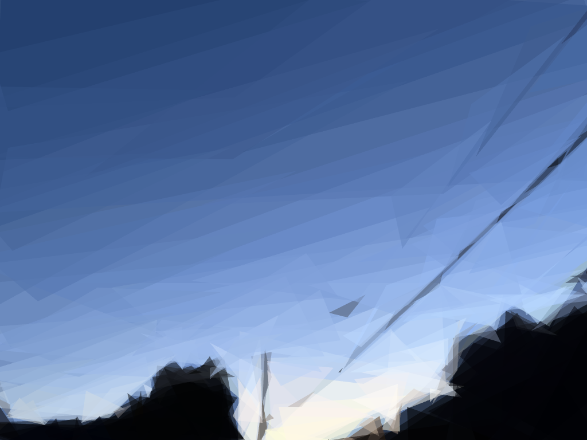

# primitive-playground
A web app that reconstructs any image using primitive shapes; port of fogleman/primitive

**English** | [Japanese](./README-ja.md)

## What's this?
This is a web application that converts any image into one expressed solely through geometric shapes. It runs on WebAssembly, with all processing performed entirely on the device.

Original|Processed
-----|-----
|

The algorithm attempts to reproduce the input image using only predefined shapes, minimizing the error between the input image and the image being drawn. This process is iterative, adding one shape at a time. The progress of shapes being added can be observed.

This is a WASM port and Web UI for the idea by fogleman: [fogleman/primitive](https://github.com/fogleman/primitive). The original primitive is a Go-based CLI tool and not easy to use, so I made it available from a browser. Please consider starring [fogleman/primitive](https://github.com/fogleman/primitive).
## Usage
You can use it by accessing [primitive-playground.taiseiue.jp](https://primitive-playground.taiseiue.jp/). Generation usually takes tens of seconds to several minutes.

The configurable values are as follows:

**Shapes**
The number of shapes to be generated. The default value is 100.

**Mode**
The shape of the figures to be generated. You can choose from `Combo`, `Triangle`, `Rectangle`, `Ellipse`, `Circle`, `Rotated Rectangle`, `Beziers`, `Rotated Ellipse`, and `Polygon`. The default value is `Triangle`.

**Alpha**
The transparency of each shape, only when `Combo` is used in Mode. The default value is 128.

**Input size**
The image will be scaled down to this size for processing. This can speed up the processing. The default value is 256px.

**Output size**
The size of the output image. The default value is 1024px.

**Preview interval**
How many shapes to update the preview after. Setting a larger value can speed up processing, but it may appear to be frozen. The default value is 10 shapes.

## License
This software is released under the [The MIT License](./LICENSE).

Copyright (c) 2025 Taisei Uemura  
Released under the [MIT license](./LICENSE)
